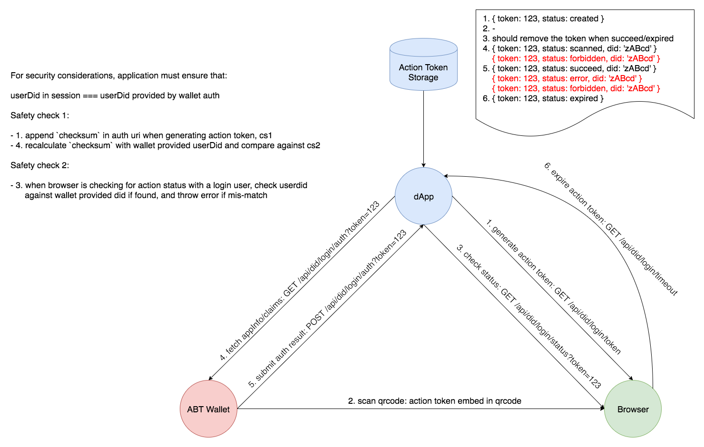
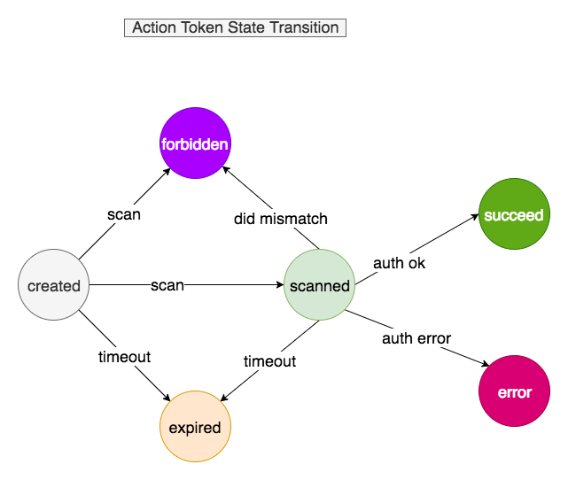

# Basic Implementation of DID Auth

Action token is heavily used to improve qrcode scanning user experience.

## Workflow

## API Endpoints

- `GET` `/api/did/login/token`
- `GET` `/api/did/login/status?token=123`
- `GET` `/api/did/login/timeout?token=123`
- `GET` `/api/did/login/auth?token=123&userDid=abc`
- `POST` `/api/did/login/auth?token=123&userDid=abc`

## Action token states

